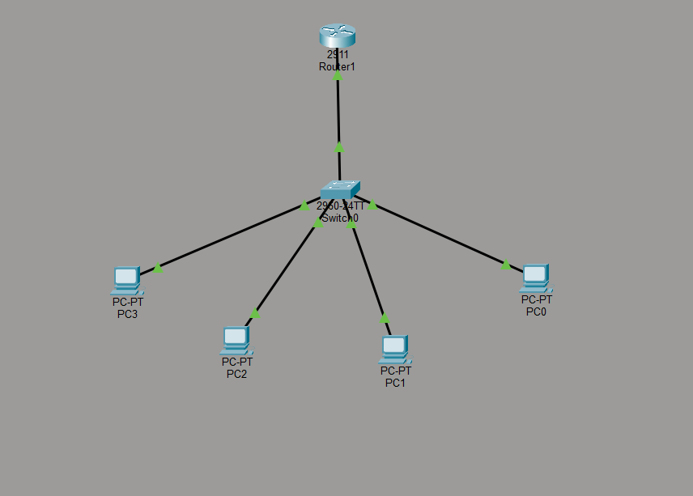
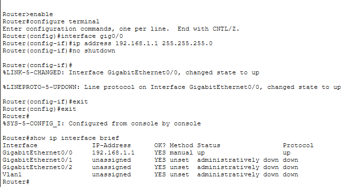
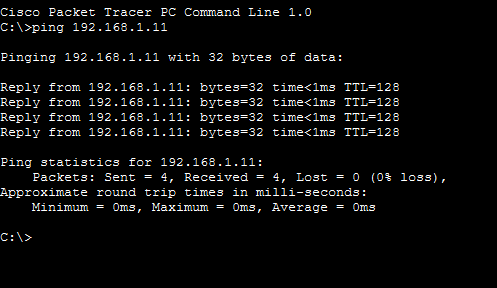

# 🖧 Basic Office Network (Cisco Packet Tracer)

## 📌 Description

This project simulates a small office network where multiple PCs are connected through a switch and router. All devices communicate using static IP addressing.

---

## 🖼️ Network Topology

---

## 🖼️ Router Configuration

---

## 🖼️ Ping Test

---

## 🛠️ Technologies Used

* Cisco Packet Tracer
* Static IP Addressing
* Basic Routing

---

## 🧱 Topology

* 1 Router
* 1 Switch
* 4 PCs

---

## 🌐 IP Addressing

| Device | IP Address   |
| ------ | ------------ |
| Router | 192.168.1.1  |
| PC0    | 192.168.1.10 |
| PC1    | 192.168.1.11 |
| PC2    | 192.168.1.12 |
| PC3    | 192.168.1.13 |

---

## ⚙️ Configuration

* Router interface configured with IP address
* PCs assigned static IP addresses
* Default gateway configured

---

## 🧪 Testing

* Successful ping between all PCs

---

## 🎯 Learning Outcome

* Understanding basic network topology
* IP addressing
* Device connectivity
